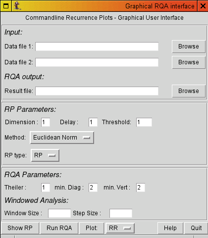
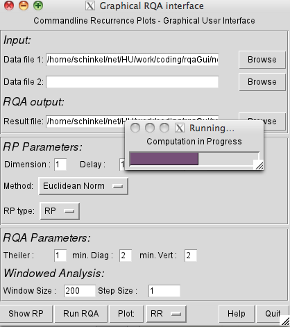
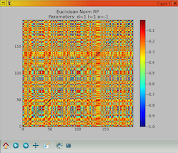
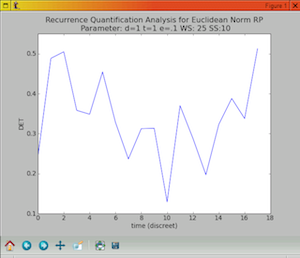

## rqaGui
 a simple python GUI frontend for commandline Recurrence Plots

### About:

The rqaGUI provides a Graphical Frontend (GUI) to the [Commandline Recurrence Plot Binary](http://tocsy.pik-potsdam.de/commandline-rp.php). It is a thin Python wrapper meant to ease the interaction with the commandline tool that allows for interactive setting of the parameters and a visualisation of RPs and RQA measures.

### Contents:

  * rqaGui.py - the thing as such
  * Progressbar.py - simple, homegrown progressbar

### Requirements:

  * the [RP Binary](http://tocsy.pik-potsdam.de/commandline-rp.php) (obviously)
  * Python 2.7 (worked on 2.4 and 2.6 too)
  * TKinter -Python's  standard GUI, should come w/ your distribution
  * matplotlib (only if you want to plot things, not  for data crunching)

### Known Issues:

On windows there are occasionally problems with piping to the binary, let me know if you have trouble

### Installation:

Make sure  Python with TKinter (and matplotlib if desired) are installed and working.

**Unix/Linux/OS X**

Download have the rp binary (renamed to 'rp') in your $PATH and make it executable.

```sh
# add path (in Bash and the likes)
export PATH=$PATH:/path/to/rp
# add path (in CSH)
setenv PATH ${PATH}:/path/to/rp
# make executable
chmod u+x rp
```

Run the
```sh
python rqaGUI.py
# or
chmod u+x rqaGUI.py && ./rqaGUI.py
```

**Windows(*)**

Download the the binary and rename it  'rp.exe'. Store it in the  same directory/folder as the rpaGUI.py file. It should start after double-clicking it.

(*) I only tested it once or twice on Win7 64bit running in  Virtualbox but I had some feedback that it works on Windows systems.

**Usage/Screenshots**

The GUI lets you  select input and output files for RP and JRPs/CRPS. Various RQA parameters are supported.



RQA can be performed using moving windows.



Simple plotting operations are implemented. These can be used for data inspection but will not produce print quality images per se.

 | 


